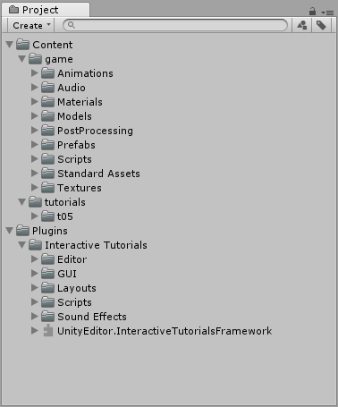
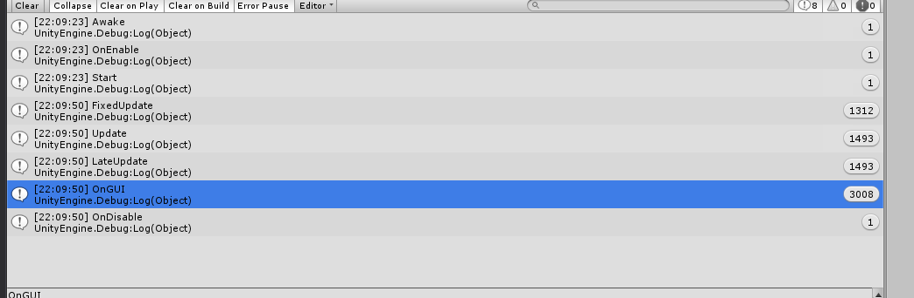
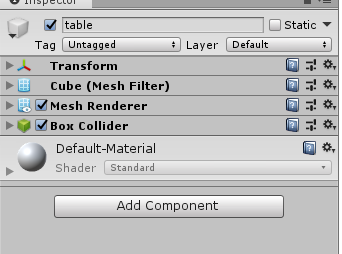
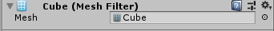
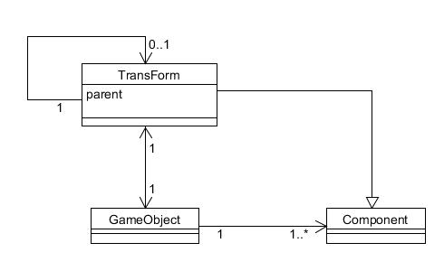

### Unity3d游戏与编程作业1

1. 简答题

- 解释 游戏对象（GameObjects） 和 资源（Assets）的区别与联系。

官方解释：

GameObjects are the fundamental objects in Unity that represent characters, props and scenery. They do not accomplish much in themselves but they act as containers for Components, which implement the real functionality.

An asset is representation of any item that can be used in your game or project. An asset may come from a file created outside of Unity, such as a 3D model, an audio file, an image, or any of the other types of file that Unity supports. There are also some asset types that can be created within Unity, such as an Animator Controller, an Audio Mixer or a Render Texture.

简单理解：

游戏对象指的是在游戏中的人物，或者其他物体，已具体的形式表现出来给玩家的一些对象，它可以有许多资源，相当于一个容器。

资源指的是构建游戏需要的一系列文件，有原画，音频等等


- 下载几个游戏案例，分别总结资源、对象组织的结构（指资源的目录组织结构与游戏对象树的层次结构）

资源的结构，会按脚本，预制脚本，图片，音频文本，字体等类型进行归类



对象树结构，按逻辑关系，呈现效果进行构建，人物，场景，道具，任务栏等等


- 编写一个代码，使用 debug 语句来验证MonoBehaviour基本行为或事件触发的条件

  - 基本行为包括 Awake() Start() Update() FixedUpdate() LateUpdate()
  - 常用事件包括 OnGUI() OnDisable() OnEnable()

   Awake() 游戏开始前执行，只执行一次，对游戏的变量或游戏状态初始化

  Start()第一次启动的时候执行，对游戏对象的初始化

   Update() 每一帧调用一次

  FixedUpdate() 以固定频率调用

  LateUpdate() 在update函数后调用

   OnGUI() 以update速度的两倍进行调用

  OnDisable() OnEnable() 成对出现，只要从激活状态变为取消激活状态就会执行一次

  ```
  using System.Collections;
  using System.Collections.Generic;
  using UnityEngine;
  
  public class NewBehaviourScript : MonoBehaviour
  {
  
      //Awake() 游戏开始前执行，只执行一次，对游戏的变量或游戏状态初始化
      void Awake()
      {
          Debug.Log("Awake");
      }
  
      //Start()第一次启动的时候执行，对游戏对象的初始化
      void Start()
      {
          Debug.Log("Start");
      }
      //Update() 每一帧调用一次
      void Update()
      {
          Debug.Log("Update");
      }
  
      //FixedUpdate() 以固定频率调用
      void FixedUpdate()
      {
          Debug.Log("FixedUpdate");
      }
      //LateUpdate() 在update函数后调用
      void LateUpdate()
      {
          Debug.Log("LateUpdate");
      }
      //OnGUI() 以update速度的两倍进行调用
      void OnGUI()
      {
          Debug.Log("OnGUI");
      }
      //OnDisable() OnEnable() 成对出现，只要从激活状态变为取消激活状态就会执行一次
      void OnDisable()
      {
          Debug.Log("OnDisable");
      }
      void OnEnable()
      {
          Debug.Log("OnEnable");
      }
  
  }
  
  ```

  

- 查找脚本手册，了解GameObject，Transform，Component 对象

  - 分别翻译官方对三个对象的描述（Description）

    - GameObject :是在Unity场景中所有元素的基类
    - Transform:物体的位置，旋转，缩放
    - Component:所有附加到游戏对象的基类。

  - 描述下图中 table 对象（实体）的属性、table 的 Transform 的属性、 table 的部件
    - 本题目要求是把可视化图形编程界面与 Unity API 对应起来，当你在 Inspector 面板上每一个内容，应该知道对应 API。
    - 例如：table 的对象是 GameObject，第一个选择框是 activeSelf 属性。
    
    
    
    table 的对象是 GameObject，第一个选择框是 activeSelf 属性，可以定义对象名称，动态或静态属性，tag理解为一类元素的标记，可以利用tag来对这个对象进行查找，layer的默认值为default，还可以选择TransParentsIFX等值，
    
    第二个选择框是Transform，可以定义物体的位置，旋转角度的，缩放（大小）
    
    
    
    第三个选择框是Mesh Fitter，网格过滤器从资源中获取网格，并将其传递给网格渲染器以在屏幕上进行渲染。
    
    
    
    第四个选择框是Mesh Renderer，网格渲染器从网格过滤器获取几何体，并在gameobject的变换组件定义的位置进行渲染。此页包含以下部分：材料，照明，探针，其他设置，光照贴图，场景中的光照贴图
    
    静态复选框关于游戏对象上的静态复选框，以及不同的激活模式。
    
    
    
    第五个选择框是Box Colider，The Box Collider is a basic cuboid-shaped collision primitive.可以调整坐标系的位置、大小。
    
    
    
    第六个选择框是Default-Material
    
    最后一个选择框是Componet，可以给对象增加行为
    
  - 用 UML 图描述 三者的关系（请使用 UMLet 14.1.1 stand-alone版本出图）

  

- 整理相关学习资料，编写简单代码验证以下技术的实现：

  - 查找对象

  可用函数

  | [Find](https://docs.unity3d.com/ScriptReference/GameObject.Find.html) | Finds a GameObject by name and retu**rns it. 通过name查找**  |
  | ------------------------------------------------------------ | ------------------------------------------------------------ |
  | **[FindGameObjectsWithTag](https://docs.unity3d.com/ScriptReference/GameObject.FindGameObjectsWithTag.html)** | **Returns a list of active GameObjects tagged tag. Returns empty array if no GameObject was found.通过tag查找多个对象** |
  | **[FindWithTag](https://docs.unity3d.com/ScriptReference/GameObject.FindWithTag.html)** | **Returns one active GameObject tagged tag. Returns null if no GameObject was found.通过tag查找一个对象** |
  | **[FindObjectOfType](https://docs.unity3d.com/ScriptReference/Object.FindObjectOfType.html)** | **Returns the first active loaded object of Type type.**     |
  | **[FindObjectsOfType](https://docs.unity3d.com/ScriptReference/Object.FindObjectsOfType.html)** | **Returns a list of all active loaded objects of Type type.** |

  

  ```
      public GameObject[] respawns;
      void Start()
      {
          Debug.Log("start excute.");
          var cube1 = GameObject.Find("chair1");
          var cube2 = GameObject.FindWithTag("Respawn");
  
          
              respawns = GameObject.FindGameObjectsWithTag("Finish");
  
          if (cube1 == null) Debug.Log("no find by name");
          else Debug.Log("succeed by name");
          if (cube2 == null) Debug.Log("no fing by tag");
          else Debug.Log("succeed by tag");
  
          if (respawns.Length == 0) Debug.Log("no find list by tag");
          else Debug.Log("findlist by tag");
  
  
      }
  ```

  

  

  - 添加子对象

  可用函数

  | [CreatePrimitive](https://docs.unity3d.com/ScriptReference/GameObject.CreatePrimitive.html) | Creates a game object with a primitive mesh renderer and appropriate collider. |
  | ------------------------------------------------------------ | ------------------------------------------------------------ |
  |                                                              |                                                              |

  ```
   void Start()
      {
          GameObject plane  = GameObject.CreatePrimitive(PrimitiveType.Plane);
  
          GameObject cube = GameObject.CreatePrimitive(PrimitiveType.Cube);
          cube.transform.position = new Vector3(0, 0.5f, 0);
  
          GameObject sphere = GameObject.CreatePrimitive(PrimitiveType.Sphere);
          sphere.transform.position = new Vector3(0, 1.5f, 0);
  
          GameObject capsule = GameObject.CreatePrimitive(PrimitiveType.Capsule);
          capsule.transform.position = new Vector3(2, 1, 0);
  
          GameObject cylinder = GameObject.CreatePrimitive(PrimitiveType.Cylinder);
          cylinder.transform.position = new Vector3(-2, 1, 0);
      }
  ```

  

  - 遍历对象树

  可用函数

  | foreach (Transform child in transform) {<br/> <br/>         Debug.Log(child.gameObject.name);<br/> <br/>} | 直接循环遍历 |
  | ------------------------------------------------------------ | ------------ |
  |                                                              |              |

  ```
      void Start()
      {
          foreach (Transform child in transform)
          {
              Debug.Log(child.gameObject.name);
          }
      }
  ```

  

  - 清除所有子对象

  可用函数

  | **[Destroy](https://docs.unity3d.com/ScriptReference/Object.Destroy.html)** | **Removes a gameobject, component or asset.**                |
  | ------------------------------------------------------------ | ------------------------------------------------------------ |
  | **[DestroyImmediate](https://docs.unity3d.com/ScriptReference/Object.DestroyImmediate.html)** | **Destroys the object obj immediately. You are strongly recommended to use Destroy instead.** |
  | **[DontDestroyOnLoad](https://docs.unity3d.com/ScriptReference/Object.DontDestroyOnLoad.html)** | **Do not destroy the target Object when loading a new Scene.** |

  ```
  foreach (Transform child in transform) {
   
           Destroy(child.gameObject);
   
  }
  ```

  

  

- 资源预设（Prefabs）与 对象克隆 (clone)

  - 预设（Prefabs）有什么好处？
  
  提前将代码进行设计打包成游戏对象，然后之后可以直接从资源中加载，成为一个游戏对象。方便了面向对象思想的应用，方便游戏设计。
  
  - 预设与对象克隆 (clone or copy or Instantiate of Unity Object) 关系？
  
  克隆是将已经存在的游戏对象进行复制克隆是对已经添加在游戏中的预设的游戏对象进行复制。预设是克隆的一个基础步骤。
  
  - 制作 table 预制，写一段代码将 table 预制资源实例化成游戏对象
  
  ```
  void Start () {
   
          Debug.Log("start!");
          Object temp = Resources.Load("desk");
          GameObject cube = Instantiate(temp) as GameObject;
   
          cube.transform.position = new Vector3(0, Random.Range(5, 7), 0);
          cube.transform.parent = this.transform;
  	}
  
  ```
  
  

2.  编程实践，小游戏

   - 游戏内容： 井字棋 或 贷款计算器 或 简单计算器 等等
   - 技术限制： 仅允许使用 **IMGUI** 构建 UI
   - 作业目的：
     - 了解 OnGUI() 事件，提升 debug 能力
     - 提升阅读 API 文档能力

   [井字棋小游戏代码传送门]()

3. 思考题【选做】

   - 微软 XNA 引擎的 Game 对象屏蔽了游戏循环的细节，并使用一组虚方法让继承者完成它们，我们称这种设计为“模板方法模式”。
     
     - 为什么是“模板方法”模式而不是“策略模式”呢？
     
     模板方法模式的主要思想：定义一个算法流程，将一些特定步骤的具体实现、延迟到子类。使得可以在不改变算法流程的情况下，通过不同的子类、来实现“定制”流程中的特定的步骤。
     
     策略模式的主要思想：使不同的算法可以被相互替换，而不影响客户端的使用。
     
     在思想和意图上看，模板方法更加强调：
     1）定义一条线（算法流程），线上的多个点是可以变化的（具体实现在子类中完成），线上的多个点一定是会被执行的，并且一定是按照特定流程被执行的。
     2）算法流程只有唯一的入口，对于点的访问是受限的【通常用受保护的虚函数来定义可变点】。
     策略模式更注重于： 一个“策略”是一个 整体的(完整的) 算法，算法是可以被整体替换的。而模板方法只能被替换其中的特定点，算法流程是固定不可变的。
     
   - 将游戏对象组成树型结构，每个节点都是游戏对象（或数）。
     - 尝试解释组合模式（Composite Pattern / 一种设计模式）。
     
     组合模式（Composite Pattern），又叫部分整体模式，是用于把一组相似的对象当作一个单一的对象。组合模式依据树形结构来组合对象，用来表示部分以及整体层次。这种类型的设计模式属于结构型模式，它创建了对象组的树形结构。
     
     这种模式创建了一个包含自己对象组的类。该类提供了修改相同对象组的方式。
     
     - 使用 BroadcastMessage() 方法，向子对象发送消息。你能写出 BroadcastMessage() 的伪代码吗?
     
     ```
     //父对象
     void Start()	{
     	this.BroadcastMessage("sendmessage");
     }
     //子对象
     void sendmessage()	{
     	Debug.Log("sendmessage succeed");
     }
     ```
     
     
     
   - 一个游戏对象用许多部件描述不同方面的特征。我们设计坦克（Tank）游戏对象不是继承于GameObject对象，而是 GameObject 添加一组行为部件（Component）。
     - 这是什么设计模式？
     
     装饰模式
     
     - 为什么不用继承设计特殊的游戏对象？
     
     装饰器模式（Decorator Pattern）允许向一个现有的对象添加新的功能，同时又不改变其结构。这种类型的设计模式属于结构型模式，它是作为现有的类的一个包装。装饰类和被装饰类可以独立发展，不会相互耦合，装饰模式是继承的一个替代模式，装饰模式可以动态扩展一个实现类的功能。
     
     使用继承，结构复杂，会产生很多子类。
     
     