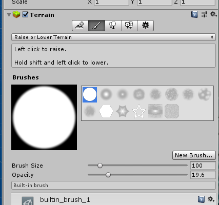
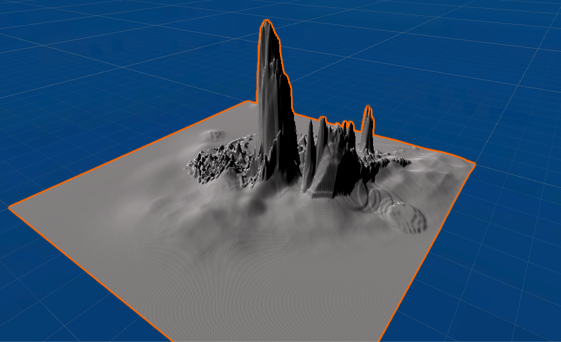
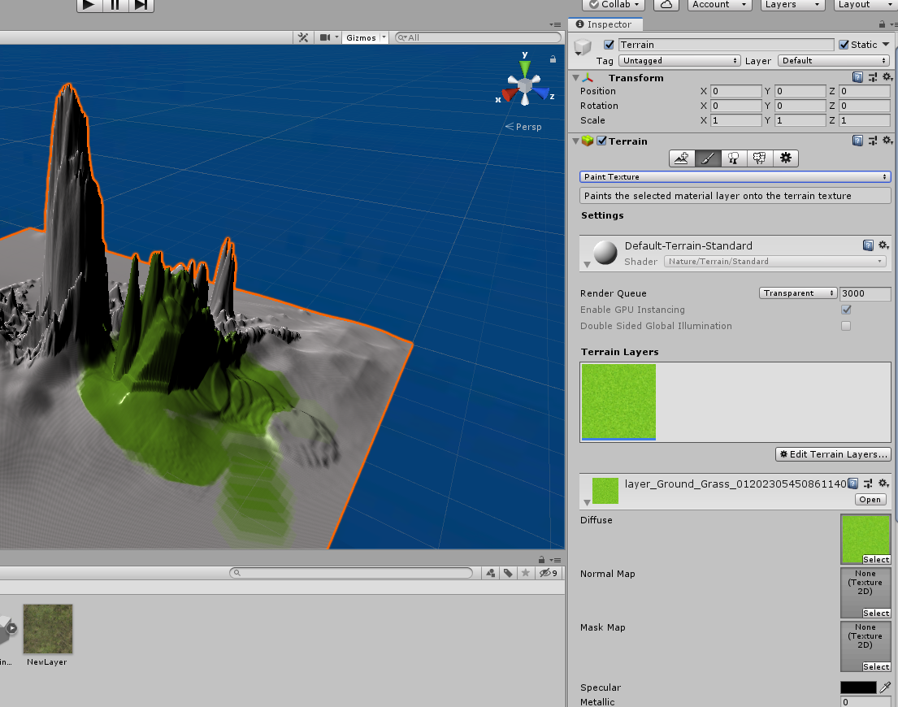
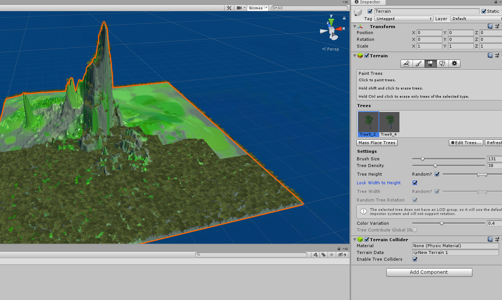
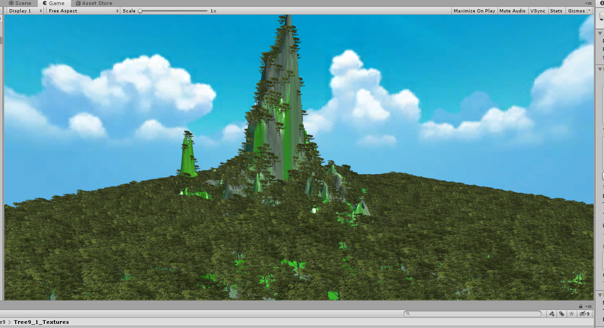
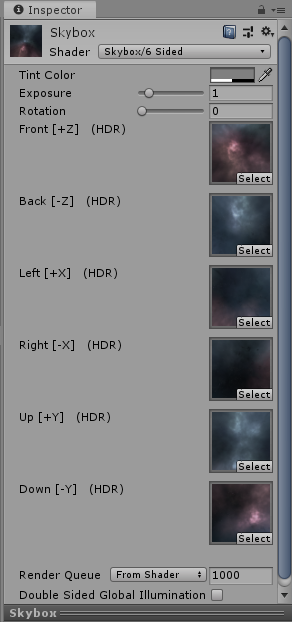
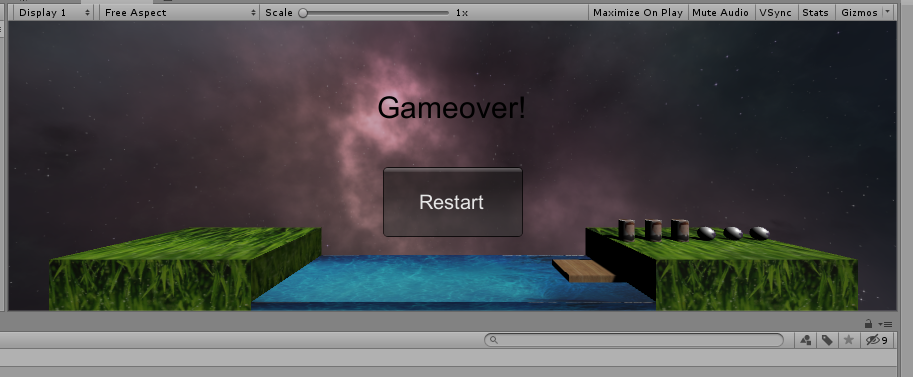

### 游戏对象与图形基础

1、基本操作演练【建议做】

- 下载Fantasy Skybox FREE， 构建自己的游戏场景

  - 创建一个3d对象Terrian，使用旁边工具进行涂抹即可随意生成山

  

  

  - 接下来需要对山进行覆盖草地，可以在Asset Store中下载Mountian的资源
  - 点击Terrain，右侧栏选择刷子图标，选择Paint Texture，添加下载资源中的图片素材，可以使用刷子在山体上覆盖，如下图可以覆盖草地

  

  - 覆盖全部草地还可以添加树木，在store下载Tree的资源，点击Terrain，选择右侧栏Paint Tree树木图标，点击Edit Trees,添加下载的素材，然后选择Brush Size使用刷子覆盖山体。

    

  - 添加sky box，在摄像机上添加组件，选择rending中的skybox，可以任意添加图片，在store下载素材，加载

  - 最后效果如下

    

- 写一个简单的总结，总结游戏对象的使用

创建游戏对象，获取游戏对象，添加组件和修改组件，发送广播和消息，克隆和预设，运动缩放，旋转，销毁游戏对象，激活或关闭游戏对象，改tag等等操作。

2、编程实践

- 牧师与魔鬼 动作分离版

在原有的MVC架构上添加Action文件来对所有的对象动作进行管理。取消原来统一的moveable类

总共有船移动和人物移动这两个移动

分别创建函数对这两个运动进行控制

```
 //船移动
    public void MoveBoat(BoatControl boatCtrl)
    {
        SSMoveToAction action;
        if (boatCtrl.status == -1)
            action = SSMoveToAction.GetSSMoveToAction(boatCtrl.from, BoatControl.speed);
        else action = SSMoveToAction.GetSSMoveToAction(boatCtrl.to, BoatControl.speed);
        boatCtrl.status = -boatCtrl.status;
        AddAction(boatCtrl.boat, action, this);
    }
```


```
//魔鬼or牧师移动
    public void MoveItem(ItemControl itemCtrl, Vector3 finalDes)
    {
        //Debug.Log("enter MoveItem!");
        float time = 3;
        float g = -10;
        Vector3 v0;
        float vy_ByGravity = 0;
        float stepTime = 0.1f;
        Vector3 currentDes = itemCtrl.item.transform.position;

        List<SSAction> divide = new List<SSAction>();

        // the des here is the final des
        v0 = new Vector3((finalDes.x - itemCtrl.item.transform.position.x) / time,
            (finalDes.y - itemCtrl.item.transform.position.y) / time - 0.5f * g * time, (finalDes.z - itemCtrl.item.transform.position.z) / time);

        for (int i = 0; i < time / stepTime - 1; i++)
        {

            vy_ByGravity += g * stepTime;
            // set current des
            currentDes += v0 * stepTime;
            currentDes.y += vy_ByGravity * stepTime;
            // get the current speed
            float currentSpeed = Mathf.Sqrt(v0.x * v0.x + (v0.y + vy_ByGravity) * (v0.y + vy_ByGravity));
            // add one of the movements
            SSAction temp = SSMoveToAction.GetSSMoveToAction(currentDes, currentSpeed * 10);
            divide.Add(temp);
        }
        SSAction seqAction = SequenceAction.GetSequenceAction(1, 0, divide);
        AddAction(itemCtrl.item, seqAction, this);
    }
```

进行物体的运动时，需要调用SSMoveToAction.GetSSMoveToAction（）函数，对该类的具体定义如下，他是所有运动的接口

```
public class SSMoveToAction : SSAction
{
    public Vector3 des;
    public float speed;

    private SSMoveToAction() { }

    public static SSMoveToAction GetSSMoveToAction(Vector3 target, float speed)
    {
        SSMoveToAction action = CreateInstance<SSMoveToAction>();
        action.des = target;
        action.speed = speed;
        return action;
    }

    public override void Start() { }

    public override void Update()
    {
        Transform.position = Vector3.MoveTowards(Transform.position, des, speed * Time.deltaTime);
        if (Transform.position == des)
        {
            destroy = true;
            Callback.ActionDone(this);
        }
    }
}
```

接下来继续定义SequenceAction类，在逻辑层次控制物体的运动，判断是否可以进行此项操作，判断此时环境是否符合继续游戏的标准，控制游戏对象的毁灭与存在。

```
public class SequenceAction : SSAction, ISSActionCallback
{
    public List<SSAction> sequence;
    public int repeat = -1;
    public int start = 0;

    public static SequenceAction GetSequenceAction(int repeat, int start, List<SSAction> sequence)
    {
        SequenceAction action = CreateInstance<SequenceAction>();
        action.sequence = sequence;
        action.repeat = repeat;
        action.start = start;
        return action;
    }

    public override void Update()
    {
        if (sequence.Count == 0) return;
        if (start < sequence.Count)
        {
            sequence[start].Update();
        }
    }

    public void ActionDone(SSAction source)
    {
        source.destroy = false;
        start++;
        if (start >= sequence.Count)
        {
            start = 0;
            if (repeat > 0) repeat--;
            if (repeat == 0)
            {
                destroy = true;
                Callback.ActionDone(this);
            }
        }
    }

    public override void Start()
    {
        foreach (SSAction action in sequence)
        {
            action.GameObject = GameObject;
            action.Transform = Transform;
            action.Callback = this;
            action.Start();
        }
    }

    void OnDestroy()
    {
        foreach (SSAction action in sequence)
        {
            DestroyObject(action);
        }
    }
}
```

最后是一个总管理的Manage类,记录进行的每一次操作，对每一个帧进行刷新。

```
public class SSActionManager : MonoBehaviour, ISSActionCallback
{
    private Dictionary<int, SSAction> actions = new Dictionary<int, SSAction>();
    private List<SSAction> waitingAdd = new List<SSAction>();
    private List<int> waitingDelete = new List<int>();

    protected void Update()
    {
        foreach (SSAction action in waitingAdd)
        {
            actions[action.GetInstanceID()] = action;
        }
        waitingAdd.Clear();

        foreach (KeyValuePair<int, SSAction> kv in actions)
        {
            SSAction action = kv.Value;
            if (action.destroy)
            {
                waitingDelete.Add(action.GetInstanceID());
            }
            else if (action.enable)
            {
                action.Update();
            }
        }

        foreach (int key in waitingDelete)
        {
            SSAction action = actions[key];
            actions.Remove(key);
            DestroyObject(action);
        }
        waitingDelete.Clear();
    }

    public void AddAction(GameObject gameObject, SSAction action, ISSActionCallback callback)
    {
        action.GameObject = gameObject;
        action.Transform = gameObject.transform;
        action.Callback = callback;
        waitingAdd.Add(action);
        action.Start();
    }

    public void ActionDone(SSAction source) { }
}
```


完成类的定义实现后需要对一些原来的函数调用进行修改

Base.cs 文件

BoatControl  类

首先删除有关moveable类的调用

添加speed `public static float speed = 50; // add in v2`

ItemControl类删除有关moveable类的调用


FirstControl.cs 文件

需要把所有对动作的使用替换成Action类中新定义的函数

```
 //add ================================
    private ActionManager MyActionManager;
```

```
//add ================================
        MyActionManager = gameObject.AddComponent<ActionManager>() as ActionManager;
```

```
 //boat.Move();
        // add ==================================
        MyActionManager.MoveBoat(boat);
```

```
//itemCtrl.MoveTo(side.GetEmptyPosition());
            MyActionManager.MoveItem(itemCtrl, side.GetEmptyPosition()); // add in v2
```

```
  //itemCtrl.MoveTo(boat.GetOnBoat(itemCtrl));
            MyActionManager.MoveItem(itemCtrl, boat.GetOnBoat(itemCtrl)); // add in v2
```


- 裁判类

  需要添加一个裁判类 ，只需要把他从firstscence中分离出来。

  ```
  public class Judger : MonoBehaviour {
  	public int Check(ShoreControl fromShore, ShoreControl toShore, BoatControl boat) {
          int from_priest = fromShore.GetItemNum(0);
          int from_devil = fromShore.GetItemNum(1);
          int to_priest = toShore.GetItemNum(0);
          int to_devil = toShore.GetItemNum(1);
  
          if (boat.status == 1)
          {
              from_priest += boat.GetItemNum(0);
              from_devil += boat.GetItemNum(1);
          }
          else
          {
              to_priest += boat.GetItemNum(0);
              to_devil += boat.GetItemNum(1);
          }
  
          if (from_priest > 0 && from_priest < from_devil) return 1;
          if (to_priest > 0 && to_priest < to_devil) return 1;
          Debug.Log("priest on to shore " + toShore.GetItemNum(0));
          Debug.Log("devil on to shore " + toShore.GetItemNum(1));
          if (toShore.GetItemNum(0) + toShore.GetItemNum(1) == 6) return 2;
          return 0;
      }
  }
  
  ```


​	在调用处先初始化此类再替换为此函数即可


最后添加天空盒

- 先下载天空盒，它会包含一些天空贴图（免去自己制作麻烦）
- Assets 上下文菜单 -> create -> Material 起名 mysky
- 在 Inspector 视图中选择 Shader -> Skybox -> 6Sided

- 在 Camera 对象中添加部件 Rendering -> Skybox，将天空盒拖进去！



效果图

